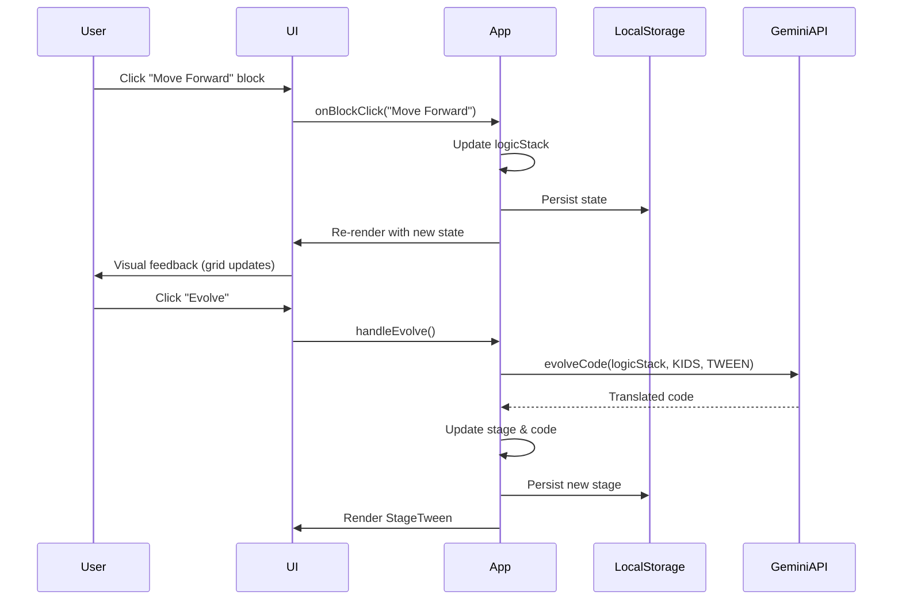

# 🏗️ EvolveCode: System Architecture Documentation

## Table of Contents

1. [Architecture Overview](#architecture-overview)
2. [Component Architecture](#component-architecture)
3. [Data Flow](#data-flow)
4. [State Management](#state-management)
5. [AI Integration Architecture](#ai-integration-architecture)
6. [Learning Progression System](#learning-progression-system)
7. [Scalability Considerations](#scalability-considerations)

---

## Architecture Overview

### High-Level System Design

```
┌─────────────────────────────────────────────────────────────┐
│                     EvolveCode Platform                      │
├─────────────────────────────────────────────────────────────┤
│                                                               │
│  ┌───────────────┐      ┌──────────────┐      ┌──────────┐ │
│  │   Frontend    │◄────►│  AI Service  │◄────►│  Gemini  │ │
│  │  (React SPA)  │      │   (Client)   │      │   API    │ │
│  └───────────────┘      └──────────────┘      └──────────┘ │
│         │                                                     │
│         ▼                                                     │
│  ┌───────────────┐                                          │
│  │ LocalStorage  │                                          │
│  │ (Persistence) │                                          │
│  └───────────────┘                                          │
│                                                               │
└─────────────────────────────────────────────────────────────┘
```

### Design Principles

1. **Progressive Disclosure**: UI complexity increases with user skill level
2. **Adaptive Scaffolding**: AI assistance adapts to learner's Zone of Proximal Development
3. **Fail-Safe Design**: Error boundaries and graceful degradation
4. **Privacy-First**: No server-side data storage, client-only processing
5. **Accessibility**: WCAG 2.1 AA compliance target

---

## Component Architecture

### Component Hierarchy

```
App (Root)
├── ErrorBoundary
│   ├── LandingPage
│   │   └── (Onboarding UI)
│   │
│   └── Main Application
│       ├── Navbar
│       │   ├── Logo
│       │   ├── Stage Badge
│       │   ├── Language Selector
│       │   ├── Mission Display
│       │   └── Evolve Button
│       │
│       ├── Main Content Area
│       │   ├── StageKids
│       │   │   ├── ChatTutor
│       │   │   ├── VisualGrid
│       │   │   └── BlockPalette
│       │   │
│       │   ├── StageTween
│       │   │   ├── BlockCanvas
│       │   │   └── PreviewArea
│       │   │
│       │   ├── StageTeen
│       │   │   ├── CodeEditor (Simplified)
│       │   │   └── OutputConsole
│       │   │
│       │   └── StagePro
│       │       ├── MonacoEditor (Future)
│       │       ├── FileTree
│       │       ├── Terminal
│       │       └── DebugPanel
│       │
│       └── AIAssistant (Sidebar)
│           ├── ChatInterface
│           ├── HintSystem
│           └── VoiceOutput
```

### Component Responsibilities

#### App.tsx (Orchestrator)

**Role**: Application state manager and router

**Responsibilities**:

- Global state management (stage, language, code, progress)
- LocalStorage synchronization
- Stage transition logic
- Error boundary wrapping
- Keyboard shortcut handling

**Key State**:

```typescript
{
  stage: Stage,              // Current learning stage
  language: Language,        // UI language
  code: string,              // Current code content
  logicStack: string[],      // Block sequence (KIDS mode)
  completedLessons: string[], // Progress tracking
  mission: string,           // AI-generated mission
  isSidebarOpen: boolean,    // AI assistant visibility
  isEvolving: boolean        // Evolution animation state
}
```

#### StageKids.tsx (Block-Based UI)

**Role**: Gamified drag-and-drop interface for ages 6-10

**Features**:

- Visual grid with emoji avatars
- Block palette (Move, Turn, Repeat)
- Chat-based tutor feedback
- Auto-run simulation
- Lesson progression

**Data Flow**:

```
User clicks block → onBlockClick(action) → App updates logicStack
→ StageKids receives new logicStack → Updates grid visualization
→ ChatTutor provides feedback
```

#### StageTween.tsx (Visual Programming)

**Role**: Scratch-like interface for ages 10-13

**Features**:

- Visual block representation
- Event-driven programming concepts
- Preview area for output
- Variable introduction

#### StageTeen.tsx (Simplified Code)

**Role**: Text-based Python for ages 13-16

**Features**:

- Basic code editor
- Syntax introduction
- Function definitions
- AI-assisted debugging

#### StagePro.tsx (Professional IDE)

**Role**: Full-featured development environment

**Features**:

- Monaco Editor integration (planned)
- File management
- Terminal emulation
- Advanced debugging
- Git integration (future)

#### AIAssistant.tsx (Adaptive Tutor)

**Role**: Context-aware AI helper

**Features**:

- Stage-appropriate tone (emojis → technical)
- Lesson-aware hints
- Code explanation
- Error diagnosis
- Voice output (KIDS mode)

**Adaptation Logic**:

```typescript
if (stage === Stage.KIDS) {
  tone = "🌟 Exciting! Use simple metaphors";
  voiceEnabled = true;
} else if (stage === Stage.PRO) {
  tone = "Professional, terse, expert";
  thinkingMode = true;
}
```

---

## Data Flow

### User Interaction Flow



### State Persistence Flow

```
Component State Change
    ↓
useEffect Hook Triggered
    ↓
localStorage.setItem()
    ↓
setLastSaved(new Date())
    ↓
UI Updates "Saved at HH:MM"
```

### AI Request Flow

```
User Query → getTutorHelp()
    ↓
Build Context:
  - Current code
  - Current lesson
  - Stage level
  - Language
    ↓
Select Model:
  - KIDS/TWEEN/TEEN: gemini-2.5-flash-lite
  - PRO: gemini-3-pro-preview (Thinking Mode)
    ↓
Apply Safety Filters
    ↓
Send to Gemini API
    ↓
Receive Response
    ↓
Format for Stage:
  - KIDS: Add emojis
  - PRO: Technical terminology
    ↓
Display in AIAssistant
```

---

## State Management

### State Architecture

**Current**: React Hooks (useState, useEffect)

**Rationale**:

- Simple application state
- No complex cross-component communication
- LocalStorage provides persistence

**Future Consideration**: Redux/Zustand if:

- Multi-user collaboration added
- Complex undo/redo needed
- State becomes deeply nested

### State Initialization Pattern

```typescript
const [stage, setStage] = useState<Stage>(() => {
  const saved = localStorage.getItem('evolve_stage');
  // Validation prevents crashes from corrupted data
  if (saved && Object.values(Stage).includes(saved as Stage)) {
    return saved as Stage;
  }
  return Stage.KIDS; // Safe default
});
```

**Benefits**:

- Lazy initialization (only runs once)
- Validation prevents invalid enum values
- Graceful fallback to default

### State Synchronization

```typescript
useEffect(() => {
  localStorage.setItem('evolve_stage', stage);
  localStorage.setItem('evolve_code', code);
  localStorage.setItem('evolve_logicStack', JSON.stringify(logicStack));
  localStorage.setItem('evolve_completedLessons', JSON.stringify(completedLessons));
  setLastSaved(new Date());
}, [stage, code, logicStack, completedLessons]);
```

**Trigger**: Any change to tracked state variables  
**Action**: Persist to LocalStorage + update timestamp  
**Risk Mitigation**: JSON.stringify errors caught during initialization

---

## AI Integration Architecture

### Service Layer Design

**File**: `services/geminiService.ts`

**Pattern**: Functional service module (not class-based)

**Rationale**:

- Stateless operations
- Easy to test
- Tree-shakeable

### API Client Initialization

```typescript
const getAiClient = () => {
  const apiKey = process.env.API_KEY;
  if (!apiKey) {
    console.error("API_KEY not found");
    return null;
  }
  return new GoogleGenAI({ apiKey });
};
```

**Safety**: Returns `null` if no API key (prevents crashes)  
**Usage**: All service functions check for `null` client

### Model Selection Strategy

| Use Case | Model | Reasoning |
|----------|-------|-----------|
| Mission generation | `gemini-2.5-flash-lite` | Speed > depth |
| Code evolution (KIDS→TWEEN) | `gemini-2.5-flash-lite` | Simple transformation |
| Code evolution (TEEN→PRO) | `gemini-3-pro-preview` | Complex refactoring |
| Tutor help (KIDS/TWEEN/TEEN) | `gemini-2.5-flash-lite` | Low latency |
| Tutor help (PRO) | `gemini-3-pro-preview` | Deep reasoning |
| Code simulation | `gemini-2.5-flash-lite` | Fast feedback |
| Text-to-Speech | `gemini-2.5-flash-preview-tts` | Specialized model |
| Image generation | `gemini-3-pro-image-preview` | Visual assets |
| Video generation | `veo-3.1-fast-generate-preview` | Animated content |

### Prompt Engineering Architecture

**Template Pattern**:

```typescript
const prompt = `
  Role: ${systemRole}
  Task: ${taskDescription}
  Context: ${contextData}
  Constraints:
  - ${constraint1}
  - ${constraint2}
  Output Format: ${outputFormat}
`;
```

**Example (Code Evolution)**:

```typescript
const prompt = `
  Act as an expert coding tutor engine.
  Task: Evolve the code from ${fromStage} to ${toStage}.
  Language: ${language}
  
  Current Input: "${currentCode}"
  
  Instruction: ${specificInstruction}
  
  Output Rules:
  - ONLY return the code content.
  - Do NOT wrap in markdown code blocks.
  - Do not add conversational text.
`;
```

**Benefits**:

- Consistent structure
- Easy to debug
- Version controllable
- A/B testable

### Safety Architecture

```typescript
const safetySettings = [
  { category: HarmCategory.HARM_CATEGORY_HATE_SPEECH, threshold: HarmBlockThreshold.BLOCK_LOW_AND_ABOVE },
  { category: HarmCategory.HARM_CATEGORY_HARASSMENT, threshold: HarmBlockThreshold.BLOCK_LOW_AND_ABOVE },
  { category: HarmCategory.HARM_CATEGORY_SEXUALLY_EXPLICIT, threshold: HarmBlockThreshold.BLOCK_LOW_AND_ABOVE },
  { category: HarmCategory.HARM_CATEGORY_DANGEROUS_CONTENT, threshold: HarmBlockThreshold.BLOCK_LOW_AND_ABOVE },
];
```

**Applied To**: All `getTutorHelp()` calls  
**Threshold**: `BLOCK_LOW_AND_ABOVE` (strictest setting)  
**Fallback**: "My safety protocols prevented a response..."

---

## Learning Progression System

### Curriculum Architecture

**File**: `data/curriculum.ts`

**Structure**:

```typescript
CURRICULUM: Record<Stage, Module[]>
  └── Module
      ├── id: string
      ├── title: string
      └── lessons: Lesson[]
          ├── id: string
          ├── title: string
          ├── description: string
          ├── task: string
          ├── solutionExplanation?: string
          └── gridConfig?: GridConfig
```

**Example**:

```typescript
[Stage.KIDS]: [
  {
    id: 'kids-m1',
    title: 'Adventure Basics',
    lessons: [
      {
        id: 'k-l1',
        title: 'Hungry Bee',
        description: 'The bee is hungry but the flower is far away.',
        task: 'Program the bee to fly to the flower.',
        gridConfig: {
          gridSize: 4,
          startPos: [0, 0],
          goalPos: [0, 3],
          avatarEmoji: '🐝',
          goalEmoji: '🌻'
        }
      }
    ]
  }
]
```

### Lesson Progression Logic

```typescript
const getCurrentLesson = () => {
  const stageModules = CURRICULUM[stage];
  if (!stageModules) return undefined;
  
  for (const module of stageModules) {
    for (const lesson of module.lessons) {
      if (!completedLessons.includes(lesson.id)) {
        return lesson; // First incomplete lesson
      }
    }
  }
  return undefined; // All lessons completed
};
```

**Algorithm**: Linear progression through modules and lessons  
**Completion Tracking**: `completedLessons` array in LocalStorage  
**Future Enhancement**: Adaptive branching based on performance

### Stage Evolution Criteria

**Current**: Manual trigger (user clicks "Evolve" button)

**Future (ML-Based)**:

```python
# From evolve-code-hackathon.ipynb
features = [
  'lessons_completed',
  'hints_requested',
  'time_spent',
  'errors_made'
]

model = RandomForestClassifier()
model.fit(training_data, labels)

prediction = model.predict(user_features)
if prediction == 'ready_to_evolve':
  suggest_evolution()
```

**Data Source**: `data/user_progression.csv`

---

## Scalability Considerations

### Current Limitations

1. **Client-Side Only**: No backend for user accounts or progress sync
2. **API Key Exposure**: Key visible in client bundle
3. **No Collaboration**: Single-user experience
4. **Limited Offline**: Requires internet for AI features
5. **LocalStorage Limits**: ~5-10MB storage cap

### Scaling Path

#### Phase 1: Backend Integration

```
Frontend (React) ←→ Backend API (Node.js/Express) ←→ Database (PostgreSQL)
                         ↓
                    Gemini API (Server-side)
```

**Benefits**:

- Secure API key storage
- User authentication
- Progress synchronization across devices
- Analytics and usage tracking

#### Phase 2: Real-Time Collaboration

```
Frontend ←→ WebSocket Server ←→ Redis (Pub/Sub)
                ↓
            Shared Code Editor (CRDT)
```

**Features**:

- Live pair programming
- Mentor-student sessions
- Classroom mode

#### Phase 3: Edge Computing

```
Frontend ←→ CDN (Cloudflare Workers) ←→ Gemini API
                ↓
            Edge Caching (Responses)
```

**Benefits**:

- Reduced latency
- Cost optimization (cached responses)
- Geographic distribution

### Database Schema (Future)

```sql
-- Users
CREATE TABLE users (
  id UUID PRIMARY KEY,
  email VARCHAR(255) UNIQUE,
  created_at TIMESTAMP
);

-- Progress
CREATE TABLE user_progress (
  user_id UUID REFERENCES users(id),
  stage VARCHAR(10),
  completed_lessons TEXT[], -- Array of lesson IDs
  current_code TEXT,
  last_updated TIMESTAMP
);

-- Analytics
CREATE TABLE learning_events (
  id UUID PRIMARY KEY,
  user_id UUID REFERENCES users(id),
  event_type VARCHAR(50), -- 'lesson_complete', 'hint_requested', etc.
  lesson_id VARCHAR(50),
  timestamp TIMESTAMP,
  metadata JSONB
);
```

### Caching Strategy (Future)

**AI Response Caching**:

```typescript
const responseCache = new Map<string, string>();

const getCachedResponse = async (prompt: string) => {
  const hash = await hashPrompt(prompt);
  if (responseCache.has(hash)) {
    return responseCache.get(hash);
  }
  const response = await geminiAPI.generateContent(prompt);
  responseCache.set(hash, response);
  return response;
};
```

**Benefits**:

- Reduced API costs
- Faster response times
- Offline capability (with IndexedDB)

---

## Security Architecture

### Current Security Measures

1. **Content Security Policy** (Future):

```html
<meta http-equiv="Content-Security-Policy" 
      content="default-src 'self'; 
               script-src 'self' https://cdn.tailwindcss.com; 
               style-src 'self' 'unsafe-inline' https://fonts.googleapis.com;">
```

1. **Input Sanitization**:

```typescript
// AI responses are text-only, not executed
// User code is simulated, not eval'd
```

1. **Error Boundaries**:

```typescript
class ErrorBoundary extends Component {
  componentDidCatch(error: Error, errorInfo: ErrorInfo) {
    console.error("Uncaught error:", error, errorInfo);
    // Future: Send to error tracking service (Sentry)
  }
}
```

### Security Risks & Mitigations

| Risk | Current State | Mitigation |
|------|---------------|------------|
| API Key Exposure | ⚠️ Exposed in client | Move to backend proxy |
| XSS Attacks | ✅ React escapes by default | Continue using JSX |
| Code Injection | ✅ No eval() used | Maintain simulation-only |
| Data Leakage | ✅ No server storage | Implement encryption for backend |
| CSRF | N/A (no backend) | Add CSRF tokens when backend added |

---

## Performance Optimization

### Current Optimizations

1. **Lazy State Initialization**:

```typescript
const [stage, setStage] = useState<Stage>(() => {
  // Only runs once on mount
  return localStorage.getItem('evolve_stage') || Stage.KIDS;
});
```

1. **Conditional Rendering**:

```typescript
// Only one stage component rendered at a time
switch (stage) {
  case Stage.KIDS: return <StageKids />;
  // Others not in DOM
}
```

1. **Audio Resource Management**:

```typescript
source.onended = () => {
  audioContext.close(); // Prevent memory leaks
};
```

### Future Optimizations

1. **Code Splitting**:

```typescript
const StagePro = React.lazy(() => import('./components/StagePro'));
```

1. **Memoization**:

```typescript
const currentLesson = useMemo(() => getCurrentLesson(), [stage, completedLessons]);
```

1. **Debounced API Calls**:

```typescript
const debouncedGetHelp = debounce(getTutorHelp, 500);
```

---

## Monitoring & Observability (Future)

### Metrics to Track

**User Engagement**:

- Time spent per stage
- Lesson completion rate
- Evolution trigger frequency
- Hint request rate

**Performance**:

- AI response latency
- Page load time
- Error rate
- LocalStorage usage

**Business**:

- Daily active users
- Retention rate (7-day, 30-day)
- Stage distribution
- API cost per user

### Implementation

```typescript
// Example: Google Analytics 4
import ReactGA from 'react-ga4';

ReactGA.initialize('G-XXXXXXXXXX');

// Track lesson completion
ReactGA.event({
  category: 'Learning',
  action: 'Lesson Complete',
  label: lesson.id,
  value: completedLessons.length
});
```

---

## Testing Architecture (Future)

### Unit Tests

```typescript
// App.test.tsx
describe('Stage Evolution', () => {
  it('should evolve from KIDS to TWEEN', async () => {
    const { getByText } = render(<App />);
    fireEvent.click(getByText('Evolve'));
    await waitFor(() => {
      expect(getByText('TWEEN')).toBeInTheDocument();
    });
  });
});
```

### Integration Tests

```typescript
// geminiService.test.ts
describe('Gemini Service', () => {
  it('should generate mission for KIDS stage', async () => {
    const mission = await generateMission(Stage.KIDS, 'en');
    expect(mission).toMatch(/🐝|🌻|🚀/); // Contains emoji
  });
});
```

### E2E Tests (Playwright)

```typescript
test('complete first lesson', async ({ page }) => {
  await page.goto('http://localhost:3000');
  await page.click('text=Start Learning');
  await page.click('button:has-text("Move Forward")');
  await page.click('button:has-text("Move Forward")');
  await page.click('button:has-text("Move Forward")');
  await expect(page.locator('text=Great job!')).toBeVisible();
});
```

---

## Accessibility Architecture

### ARIA Implementation

```typescript
// Navbar
<nav role="navigation" aria-label="Main Navigation">
  <button aria-label="Toggle AI Tutor Sidebar" aria-expanded={isSidebarOpen}>
    <i className="fas fa-columns" aria-hidden="true"></i>
  </button>
</nav>

// Main content
<main role="main">
  {renderStage()}
</main>

// Status updates
<div role="status" aria-label="Current Mission">
  {mission}
</div>
```

### Keyboard Navigation

**Current**:

- Tab navigation through interactive elements
- Ctrl+S / Cmd+S for save

**Future**:

- Arrow keys for block selection (KIDS mode)
- Esc to close modals
- Shortcuts for common actions (Ctrl+E for Evolve)

### Screen Reader Support

**Semantic HTML**:

```html
<h1>EvolveCode</h1>
<section aria-labelledby="lesson-title">
  <h2 id="lesson-title">Hungry Bee</h2>
  <p>The bee is hungry...</p>
</section>
```

**Dynamic Updates**:

```typescript
// Announce lesson completion
<div role="alert" aria-live="assertive">
  Lesson completed! 🎉
</div>
```

---

## Internationalization (i18n) Architecture

### Translation System

**File**: `data/translations.ts`

**Structure**:

```typescript
export const TRANSLATIONS: Record<Language, TranslationSet> = {
  en: {
    appTitle: "EvolveCode",
    evolve: "Evolve",
    loadingMission: "Loading mission...",
    // ...
  },
  es: {
    appTitle: "EvolveCode",
    evolve: "Evolucionar",
    loadingMission: "Cargando misión...",
    // ...
  }
};
```

**Usage**:

```typescript
const t = TRANSLATIONS[language];
<h1>{t.appTitle}</h1>
```

**Dynamic Content** (AI-generated):

```typescript
const prompt = `
  Generate mission in ${language}.
  Output ONLY the sentence in ${language}.
`;
```

---

## Deployment Architecture

### Build Process

```bash
npm run build
  ↓
Vite bundles:
  - Transpiles TypeScript → JavaScript
  - Bundles React components
  - Injects environment variables
  - Minifies code
  - Generates source maps
  ↓
Output: dist/
  ├── index.html
  ├── assets/
  │   ├── index-[hash].js
  │   └── index-[hash].css
  └── ...
```

### Hosting Options

| Platform | Pros | Cons |
|----------|------|------|
| **Vercel** | Auto-deploy, edge network, env vars | API key in client |
| **Netlify** | Easy setup, forms, functions | API key in client |
| **GitHub Pages** | Free, simple | No env vars, no backend |
| **Cloudflare Pages** | Fast CDN, Workers for backend | Learning curve |

### Environment Variables

**Development**:

```bash
# .env (local)
GEMINI_API_KEY=your_key_here
```

**Production** (Vercel):

```bash
vercel env add GEMINI_API_KEY
# Select: Production, Preview, Development
```

**Access in Code**:

```typescript
const apiKey = process.env.API_KEY; // Injected by Vite
```

---

## Future Architecture Enhancements

### 1. Microservices Architecture

```
Frontend (React) ←→ API Gateway
                        ↓
        ┌───────────────┼───────────────┐
        ↓               ↓               ↓
    Auth Service   Learning Service   AI Service
        ↓               ↓               ↓
    User DB      Progress DB      Gemini API
```

### 2. Event-Driven Architecture

```
User Action → Event Bus (Kafka/RabbitMQ)
                ↓
    ┌───────────┼───────────┐
    ↓           ↓           ↓
Analytics   Progress    Recommendations
Service     Service     Service
```

### 3. Offline-First Architecture

```
Frontend ←→ Service Worker ←→ IndexedDB
              ↓
          Background Sync
              ↓
          Backend API
```

---

**Last Updated**: 2026-02-04  
**Architecture Version**: 1.0.0  
**Maintained By**: EvolveCode Team
