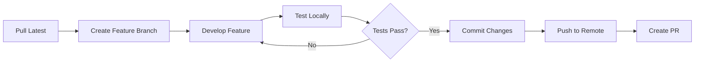

# 🔄 EvolveCode: Development Workflow Guide

## Table of Contents

1. [Getting Started](#getting-started)
2. [Development Workflow](#development-workflow)
3. [Feature Development](#feature-development)
4. [AI Integration Workflow](#ai-integration-workflow)
5. [Testing Strategy](#testing-strategy)
6. [Deployment Workflow](#deployment-workflow)
7. [Troubleshooting](#troubleshooting)

---

## Getting Started

### Prerequisites

- **Node.js**: v18.0.0 or higher
- **npm**: v9.0.0 or higher
- **Google Gemini API Key**: [Get one here](https://aistudio.google.com/apikey)
- **Modern Browser**: Chrome, Firefox, Safari, or Edge (latest versions)

### Initial Setup

```bash
# 1. Clone the repository
git clone <repository-url>
cd evo-code

# 2. Install dependencies
npm install

# 3. Create environment file
touch .env

# 4. Add your API key to .env
echo "GEMINI_API_KEY=your_api_key_here" >> .env

# 5. Start development server
npm run dev

# 6. Open browser
# Navigate to http://localhost:3000
```

### Project Structure Navigation

```
evo-code/
├── 📄 Configuration Files
│   ├── package.json          # Dependencies and scripts
│   ├── tsconfig.json         # TypeScript configuration
│   ├── vite.config.ts        # Build tool configuration
│   └── .env                  # Environment variables (create this)
│
├── 🎨 Frontend Code
│   ├── index.html            # Entry HTML file
│   ├── index.tsx             # React entry point
│   ├── App.tsx               # Main application component
│   └── types.ts              # TypeScript type definitions
│
├── 🧩 Components (components/)
│   ├── LandingPage.tsx       # Onboarding screen
│   ├── StageKids.tsx         # Block-based interface
│   ├── StageTween.tsx        # Scratch-like interface
│   ├── StageTeen.tsx         # Simplified code editor
│   ├── StagePro.tsx          # Professional IDE
│   ├── AIAssistant.tsx       # AI tutor sidebar
│   ├── ChatTutor.tsx         # Conversational UI
│   └── VisualGrid.tsx        # Game grid visualization
│
├── 🤖 AI Services (services/)
│   └── geminiService.ts      # Gemini API integration
│
├── 📚 Data (data/)
│   ├── curriculum.ts         # Lesson structure
│   ├── levels.ts             # Teaching configurations
│   ├── translations.ts       # i18n strings
│   └── user_progression.csv  # ML training data
│
└── 📖 Documentation
    ├── README.md             # Project overview
    ├── DESIGN_JOURNAL.md     # Learning science rationale
    ├── VIDEO_SCRIPT.md       # Pitch script
    ├── STACK_DOCUMENTATION.md # Technology stack
    └── WORKFLOW_GUIDE.md     # This file
```

---

## Development Workflow

### Daily Development Cycle



### Branch Strategy

```bash
# Main branches
main          # Production-ready code
develop       # Integration branch

# Feature branches
feature/kids-stage-improvements
feature/ai-tutor-enhancements
feature/curriculum-expansion

# Bugfix branches
bugfix/evolution-animation-glitch
bugfix/localstorage-corruption

# Hotfix branches
hotfix/api-key-validation
```

### Commit Message Convention

```bash
# Format: <type>(<scope>): <subject>

# Types:
feat     # New feature
fix      # Bug fix
docs     # Documentation changes
style    # Code style changes (formatting)
refactor # Code refactoring
perf     # Performance improvements
test     # Adding tests
chore    # Build process or auxiliary tool changes

# Examples:
git commit -m "feat(kids-stage): add repeat block functionality"
git commit -m "fix(ai-assistant): prevent duplicate API calls"
git commit -m "docs(readme): update deployment instructions"
git commit -m "refactor(gemini-service): extract audio playback logic"
```

---

## Feature Development

### Adding a New Stage Component

**Example: Creating a "MENTOR" stage between TEEN and PRO**

#### Step 1: Update Type Definitions

```typescript
// types.ts
export enum Stage {
  KIDS = 'KIDS',
  TWEEN = 'TWEEN',
  TEEN = 'TEEN',
  MENTOR = 'MENTOR',  // NEW
  PRO = 'PRO'
}
```

#### Step 2: Create Component

```typescript
// components/StageMentor.tsx
import React from 'react';

interface StageMentorProps {
  code: string;
  setCode: (code: string) => void;
  lesson?: Lesson;
  onComplete: () => void;
}

export const StageMentor: React.FC<StageMentorProps> = ({ 
  code, 
  setCode, 
  lesson, 
  onComplete 
}) => {
  return (
    <div className="h-full bg-gray-800 text-white">
      {/* Your component UI */}
    </div>
  );
};
```

#### Step 3: Register in App.tsx

```typescript
// App.tsx
import { StageMentor } from './components/StageMentor';

const renderStage = () => {
  switch (stage) {
    case Stage.KIDS:
      return <StageKids {...props} />;
    case Stage.TWEEN:
      return <StageTween {...props} />;
    case Stage.TEEN:
      return <StageTeen {...props} />;
    case Stage.MENTOR:  // NEW
      return <StageMentor {...props} />;
    case Stage.PRO:
      return <StagePro {...props} />;
  }
};
```

#### Step 4: Update Evolution Logic

```typescript
// App.tsx - handleEvolve()
if (stage === Stage.TEEN) {
  nextStage = Stage.MENTOR;  // Changed from Stage.PRO
  nextCode = await evolveCode(code, Stage.TEEN, Stage.MENTOR, language);
} else if (stage === Stage.MENTOR) {  // NEW
  nextStage = Stage.PRO;
  nextCode = await evolveCode(code, Stage.MENTOR, Stage.PRO, language);
}
```

#### Step 5: Add Curriculum

```typescript
// data/curriculum.ts
[Stage.MENTOR]: [
  {
    id: 'mentor-m1',
    title: 'Code Review Fundamentals',
    lessons: [
      { 
        id: 'm-l1', 
        title: 'Refactoring Basics', 
        description: 'Learn to improve existing code.',
        task: 'Refactor the provided function for readability.'
      }
    ]
  }
]
```

#### Step 6: Update Translations

```typescript
// data/translations.ts
export const TRANSLATIONS = {
  en: {
    stages: {
      MENTOR: 'Mentor Mode'
    }
  }
};
```

---

### Adding a New Lesson

**Example: Adding "Nested Loops" to KIDS stage**

```typescript
// data/curriculum.ts
[Stage.KIDS]: [
  {
    id: 'kids-m2',
    title: 'Loop Magic',
    lessons: [
      // ... existing lessons
      {
        id: 'k-l6',  // NEW
        title: 'Loop Maze',
        description: 'Navigate a complex path using nested loops.',
        task: 'Use Repeat inside Repeat to create a square path.',
        solutionExplanation: 'Nested loops allow us to repeat patterns within patterns.',
        gridConfig: {
          gridSize: 6,
          startPos: [0, 0],
          goalPos: [0, 0],  // Return to start
          avatarEmoji: '🐝',
          goalEmoji: '🏁',
          backgroundTheme: 'grass'
        }
      }
    ]
  }
]
```

---

### Adding a New AI Feature

**Example: Adding Code Explanation Feature**

#### Step 1: Add Service Function

```typescript
// services/geminiService.ts
export const explainCode = async (
  code: string, 
  stage: Stage, 
  language: Language
): Promise<string> => {
  const ai = getAiClient();
  if (!ai) return "API Key required.";

  const prompt = `
    Explain this code in ${language} for a ${stage} level student.
    Code: ${code}
    
    Rules:
    - Use simple language for KIDS/TWEEN
    - Use technical terms for TEEN/PRO
    - Keep explanation under 100 words
  `;

  try {
    const response = await ai.models.generateContent({
      model: 'gemini-2.5-flash-lite',
      contents: prompt,
    });
    return response.text?.trim() || "Explanation unavailable.";
  } catch (error) {
    console.error("Explanation failed:", error);
    return "Unable to explain code.";
  }
};
```

#### Step 2: Add UI Button

```typescript
// components/StageTeen.tsx
const [explanation, setExplanation] = useState<string>('');

const handleExplain = async () => {
  const result = await explainCode(code, Stage.TEEN, 'en');
  setExplanation(result);
};

return (
  <div>
    <button onClick={handleExplain}>
      Explain Code
    </button>
    {explanation && <div>{explanation}</div>}
  </div>
);
```

---

## AI Integration Workflow

### Working with Gemini API

#### 1. Testing API Calls Locally

```typescript
// Create a test file: services/geminiTest.ts
import { getTutorHelp } from './geminiService';
import { Stage } from '../types';

async function testTutor() {
  const response = await getTutorHelp(
    "How do I create a loop?",
    "for i in range(10): print(i)",
    Stage.TEEN,
    "Learn loops",
    'en'
  );
  console.log(response);
}

testTutor();
```

```bash
# Run test
npx tsx services/geminiTest.ts
```

#### 2. Monitoring API Usage

```typescript
// Add logging wrapper
const originalGenerateContent = ai.models.generateContent;
ai.models.generateContent = async (...args) => {
  console.log('[API Call]', new Date().toISOString(), args[0].model);
  const result = await originalGenerateContent.apply(ai.models, args);
  console.log('[API Response]', result.text?.length, 'chars');
  return result;
};
```

#### 3. Handling Rate Limits

```typescript
// services/geminiService.ts
const delay = (ms: number) => new Promise(resolve => setTimeout(resolve, ms));

export const getTutorHelpWithRetry = async (
  ...args: Parameters<typeof getTutorHelp>
): Promise<string> => {
  let attempts = 0;
  const MAX_RETRIES = 3;

  while (attempts < MAX_RETRIES) {
    try {
      return await getTutorHelp(...args);
    } catch (error: any) {
      if (error.message?.includes('429')) {  // Rate limit
        attempts++;
        await delay(2000 * attempts);  // Exponential backoff
      } else {
        throw error;
      }
    }
  }
  return "Service temporarily unavailable.";
};
```

#### 4. Optimizing Prompts

**Before:**

```typescript
const prompt = "Explain this code: " + code;
```

**After:**

```typescript
const prompt = `
  Role: Expert coding tutor for ${stage} level
  Task: Explain the following code
  Constraints:
  - Max 50 words
  - Use ${language} language
  - Avoid jargon for KIDS/TWEEN
  
  Code:
  \`\`\`
  ${code}
  \`\`\`
`;
```

---

## Testing Strategy

### Manual Testing Checklist

#### Before Each Commit

- [ ] All stages render without errors
- [ ] Evolution animation works smoothly
- [ ] LocalStorage persists state correctly
- [ ] AI assistant responds appropriately
- [ ] Language switching works
- [ ] Mobile responsive layout intact
- [ ] No console errors

#### Stage-Specific Tests

**KIDS Stage:**

- [ ] Blocks are clickable and add to logic stack
- [ ] Grid visualization updates correctly
- [ ] Clear All button works
- [ ] Lesson completion triggers correctly

**TWEEN Stage:**

- [ ] Visual blocks render from logic stack
- [ ] Preview area shows expected output

**TEEN Stage:**

- [ ] Code editor accepts input
- [ ] Syntax highlighting works (if implemented)
- [ ] Run button executes code simulation

**PRO Stage:**

- [ ] Full IDE features functional
- [ ] Terminal output displays correctly
- [ ] File tree navigation works

### Automated Testing (Future)

```bash
# Install testing dependencies
npm install --save-dev jest @testing-library/react @testing-library/jest-dom

# Create test file: App.test.tsx
import { render, screen } from '@testing-library/react';
import App from './App';

test('renders landing page on first load', () => {
  render(<App />);
  expect(screen.getByText(/EvolveCode/i)).toBeInTheDocument();
});

# Run tests
npm test
```

---

## Deployment Workflow

### Vercel Deployment (Recommended)

#### First-Time Setup

```bash
# 1. Install Vercel CLI
npm install -g vercel

# 2. Login
vercel login

# 3. Link project
vercel link

# 4. Set environment variable
vercel env add GEMINI_API_KEY
# Paste your API key when prompted
# Select: Production, Preview, Development

# 5. Deploy
vercel --prod
```

#### Continuous Deployment

```bash
# Push to main branch triggers auto-deployment
git push origin main

# Manual deployment
vercel --prod
```

### Netlify Deployment

#### Using Netlify CLI

```bash
# 1. Install CLI
npm install -g netlify-cli

# 2. Login
netlify login

# 3. Initialize
netlify init

# 4. Set environment variable
netlify env:set GEMINI_API_KEY your_api_key_here

# 5. Deploy
netlify deploy --prod
```

#### Using Netlify UI

1. Go to [netlify.com](https://netlify.com)
2. Click "Add new site" → "Import an existing project"
3. Connect your Git repository
4. Build settings:
   - **Build command**: `npm run build`
   - **Publish directory**: `dist`
5. Add environment variable:
   - **Key**: `GEMINI_API_KEY`
   - **Value**: Your API key
6. Click "Deploy site"

### GitHub Pages (Static Hosting)

```bash
# 1. Install gh-pages
npm install --save-dev gh-pages

# 2. Add to package.json
{
  "scripts": {
    "predeploy": "npm run build",
    "deploy": "gh-pages -d dist"
  },
  "homepage": "https://yourusername.github.io/evo-code"
}

# 3. Deploy
npm run deploy
```

**Note**: GitHub Pages doesn't support environment variables. Consider using a backend proxy for API key security.

---

## Troubleshooting

### Common Issues

#### 1. "API_KEY not found" Error

**Symptoms**: AI features don't work, console shows API key error

**Solutions**:

```bash
# Check .env file exists
ls -la .env

# Verify content
cat .env
# Should show: GEMINI_API_KEY=your_key

# Restart dev server
# Ctrl+C to stop
npm run dev
```

#### 2. Evolution Animation Stuck

**Symptoms**: Screen stays black after clicking "Evolve"

**Solutions**:

```typescript
// Check browser console for errors
// Common cause: API call failed

// Temporary fix: Reset state
localStorage.clear();
window.location.reload();
```

#### 3. LocalStorage Corruption

**Symptoms**: App crashes on load, blank screen

**Solutions**:

```javascript
// Open browser console (F12)
localStorage.removeItem('evolve_stage');
localStorage.removeItem('evolve_logicStack');
location.reload();
```

#### 4. Build Fails

**Symptoms**: `npm run build` errors

**Solutions**:

```bash
# Clear cache
rm -rf node_modules
rm package-lock.json

# Reinstall
npm install

# Try build again
npm run build
```

#### 5. TypeScript Errors

**Symptoms**: Red squiggly lines in editor

**Solutions**:

```bash
# Restart TypeScript server (VS Code)
# Ctrl+Shift+P → "TypeScript: Restart TS Server"

# Check tsconfig.json is valid
npx tsc --noEmit
```

### Performance Issues

#### Slow AI Responses

**Cause**: Using `gemini-3-pro-preview` for simple tasks

**Solution**:

```typescript
// Use Flash-Lite for fast responses
model: 'gemini-2.5-flash-lite'  // Instead of gemini-3-pro-preview
```

#### High Memory Usage

**Cause**: AudioContext not closed after playback

**Solution**: Already implemented in `playRawAudio()` with `source.onended`

#### Slow Page Load

**Cause**: Large bundle size

**Solution**:

```typescript
// Implement code splitting
const StagePro = React.lazy(() => import('./components/StagePro'));

// Wrap in Suspense
<Suspense fallback={<div>Loading...</div>}>
  <StagePro />
</Suspense>
```

---

## Git Workflow Best Practices

### Before Starting Work

```bash
git checkout main
git pull origin main
git checkout -b feature/your-feature-name
```

### During Development

```bash
# Commit frequently with meaningful messages
git add .
git commit -m "feat(kids-stage): add new block type"

# Push to remote regularly
git push origin feature/your-feature-name
```

### Creating a Pull Request

```bash
# 1. Ensure your branch is up to date
git checkout main
git pull origin main
git checkout feature/your-feature-name
git merge main

# 2. Resolve any conflicts
# 3. Push final changes
git push origin feature/your-feature-name

# 4. Create PR on GitHub/GitLab
# 5. Request review from team
```

### After PR Approval

```bash
# Merge via GitHub UI (recommended)
# OR manually:
git checkout main
git merge feature/your-feature-name
git push origin main

# Delete feature branch
git branch -d feature/your-feature-name
git push origin --delete feature/your-feature-name
```

---

## Code Review Checklist

### For Reviewers

- [ ] Code follows TypeScript best practices
- [ ] No console.log statements (use proper logging)
- [ ] Error handling implemented
- [ ] Accessibility attributes added (ARIA labels)
- [ ] Responsive design maintained
- [ ] No hardcoded strings (use translations.ts)
- [ ] API calls have error handling
- [ ] LocalStorage updates are safe
- [ ] No security vulnerabilities (API key exposure)

### For Authors

- [ ] Self-review completed
- [ ] All tests pass locally
- [ ] Documentation updated
- [ ] No merge conflicts
- [ ] Meaningful commit messages
- [ ] PR description explains changes

---

## Maintenance Tasks

### Weekly

- [ ] Check for dependency updates: `npm outdated`
- [ ] Review console warnings in dev mode
- [ ] Test all stages for regressions
- [ ] Monitor API usage/costs

### Monthly

- [ ] Update dependencies: `npm update`
- [ ] Review and close stale issues
- [ ] Update documentation
- [ ] Performance audit (Lighthouse)

### Quarterly

- [ ] Security audit: `npm audit`
- [ ] Refactor technical debt
- [ ] User feedback analysis
- [ ] Curriculum expansion planning

---

## Resources

### Official Documentation

- [React Docs](https://react.dev)
- [TypeScript Handbook](https://www.typescriptlang.org/docs/)
- [Vite Guide](https://vitejs.dev/guide/)
- [Tailwind CSS](https://tailwindcss.com/docs)
- [Google Gemini API](https://ai.google.dev/gemini-api/docs)

### Internal Documentation

- `STACK_DOCUMENTATION.md` - Technology stack details
- `DESIGN_JOURNAL.md` - Learning science rationale
- `README.md` - Project overview

### Community

- GitHub Issues - Bug reports and feature requests
- Discussions - General questions and ideas

---

**Last Updated**: 2026-02-04  
**Maintained By**: EvolveCode Team  
**Version**: 1.0.0
